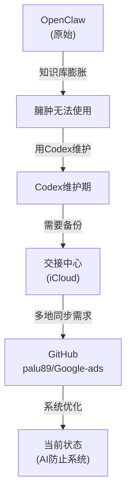

# 仓库架构与同步策略

**Updated**: 2026-04-08  
**Context**: OpenClaw → Codex → 交接中心 → GitHub → 当前优化

---

## 历史演化



---

## 当前三层架构

### 层1：GitHub （True Source of Truth）

**URL**: `https://github.com/palu89/Google-ads.git`

**Role**: 
- 唯一的public源头
- 多地同步的中枢
- CI/CD验证的对象
- 所有重要改动最终目的地

**当前状态**:
- 最新Remote Commit: `4ee9640` (origin/main)
- 最新Local Commits: `a4fcc07`, `126c72c` (待推送)
- 待推送内容: AI Error Prevention System

---

### 层2：交接中心 （Cold Backup + Historical Reference）

**Path**: `/Users/palu/Library/Mobile Documents/com~apple~CloudDocs/交接中心`

**Role**: 
- iCloud自动双向同步（备份）
- 历史参考
- 离线访问能力
- 跨Mac/iPad同步

**当前状态**:
- HEAD: `45f8e6b0` (提交所有项目文件)
- 与GitHub已OUT OF SYNC（设计使然）
- 用途：历史记录、参考、冷备

---

### 层3：工作目录 （Development/Current）

**Path**: `/Users/palu/Google-ads`

**Role**:
- 当前活跃工作目录
- 本地编辑和测试
- 创建改动的地方

**当前状态**:
- HEAD: `a4fcc07` (AI防止系统已提交)
- 领先origin/main 2 commits
- 已完成：AGENT_BOOTSTRAP v2、AI防止系统完整部署

---

## 同步流向

```
┌─────────────────────────────────────┐
│   /Users/palu/Google-ads            │  
│  （工作目录，最新改动）             │
│   HEAD: a4fcc07 (待推送)            │
└────────────────┬────────────────────┘
                 │
          ┌──────▼────────┐
          │ git push      │ (推送到GitHub)
          │ origin main   │
          └──────┬────────┘
                 │
    ╔════════════▼═════════════╗
    ║    GitHub               ║
    ║ palu89/Google-ads       ║  (True Source)
    ║ (远程真源头)           ║
    ╚══════════╤═══════════════╝
             │
    ┌────────▼────────────┐
    │ iCloud Sync         │ (自动或手动)
    │ git pull/sync       │
    └────────┬────────────┘
             │
    ┌────────▼──────────────────────┐
    │ 交接中心                       │
    │ (iCloud冷备)                 │
    │ HEAD: 45f8e6b0 (历史状态)    │
    └───────────────────────────────┘
```

---

## 操作流程

### 场景1：在工作目录做改动（✅ 当前状态）

```bash
# 1. 在 /Users/palu/Google-ads 工作
cd /Users/palu/Google-ads

# 2. 创建改动
echo "new code" >> file.md

# 3. 本地提交
git add .
git commit -m "feat: description"

# 4. 推送到GitHub（True Source）
git push origin main  # ← 当前网络问题，但流程正确

# 5. 可选：同步到交接中心（冷备）
cd "/Users/palu/Library/Mobile Documents/com~apple~CloudDocs/交接中心"
git pull origin main  # 拉取最新从GitHub
```

### 场景2：在其他地点/设备（如Mac家里、办公室）

```bash
# 1. 克隆或拉取
git clone https://github.com/palu89/Google-ads.git /work/Google-ads
# 或
git pull origin main

# 2. 在那个位置做改动
# ... work ...
git commit -m "feat: ..."

# 3. 推送到GitHub
git push origin main

# 家里的更新会自动拉取到其他地点
```

### 场景3：备份和恢复

```bash
# 定期同步交接中心为冷备
cd /Users/palu/Library/Mobile Documents/com~apple~CloudDocs/交接中心
git pull origin main

# 如果工作目录坏了，可以从GitHub恢复
cd /Users/palu/Google-ads
git reset --hard origin/main
```

---

## 当前待办事项

### 🚨 紧急：推送AI防止系统到GitHub

**状态**: 2 commits 在本地，未推送

**Commits**:
1. `126c72c`: Deploy AGENT_BOOTSTRAP v2 with strict Five-Gate Entry Protocol
2. `a4fcc07`: Deploy comprehensive AI Error Prevention System with 6-layer architecture

**如何推送**:
```bash
cd /Users/palu/Google-ads

# 如果网络恢复
git push origin main

# 如果HTTPS代理问题，试试SSH
git remote set-url origin git@github.com:palu89/Google-ads.git
git push origin main

# 或者用交接中心的SSH配置
cd "/Users/palu/Library/Mobile Documents/com~apple~CloudDocs/交接中心"
# 这个用的是 git@github.com 而不是 https
```

### 📋 后续：同步到交接中心

一旦GitHub有最新内容，同步到iCloud：

```bash
cd "/Users/palu/Library/Mobile Documents/com~apple~CloudDocs/交接中心"
git pull origin main
# 或
git fetch origin && git reset --hard origin/main
```

---

## 关键原则

### ✅ DO:

1. **GitHub is Truth** — GitHub上的内容永远是最新的源头
2. **Work in /Users/palu/Google-ads** — 这是当前工作目录
3. **Commit locally first** — 本地提交成功再推送
4. **Push to origin main** — 所有改动最终都要到GitHub
5. **交接中心 as Cold Backup** — 定期从GitHub同步备份

### ❌ DON'T:

1. ❌ 在交接中心直接修改重要文件（它是冷备）
2. ❌ 跳过GitHub直接在本地完成工作（容易丢失）
3. ❌ 让多个目录各自为政（会产生冲突）
4. ❌ 混淆真源头（GitHub是唯一真源头）

---

## 当前状态总结

### ✅ 已完成

- AI防止系统完整设计和部署（在/Users/palu/Google-ads）
- 本地Git提交成功（2 commits）
- 系统架构清晰（Six-Layer防止系统）

### ⏳ 待完成

- **推送到GitHub** (受网络问题阻挡，需要手动执行)
- 从GitHub同步到交接中心（等推送完成后）
- 新AI工具的第一次测试（等系统上线后）

### 📊 Commit Summary

```
Current:  /Users/palu/Google-ads HEAD a4fcc07
Remote:   GitHub origin/main 4ee9640
Behind:   0 commits behind
Ahead:    2 commits ahead (待推送)

待推送列表:
- 126c72c: Deploy AGENT_BOOTSTRAP v2 ...
- a4fcc07: Deploy comprehensive AI Error Prevention System ...
```

---

## 推送指引

### 如果HTTPS继续报错，试试SSH:

```bash
cd /Users/palu/Google-ads

# 检查SSH配置
ssh -T git@github.com
# 如果成功输出 "Hi palu89! You've successfully authenticated."

# 改用SSH URL
git remote set-url origin git@github.com:palu89/Google-ads.git

# 尝试推送
git push origin main
```

### 或者从交接中心推送（它已配置SSH）:

```bash
cd "/Users/palu/Library/Mobile Documents/com~apple~CloudDocs/交接中心"

# 添加最新改动（如果需要）
git pull /Users/palu/Google-ads main

# 推送
git push origin main
```

---

## 图表：文件来源关系

```
研发时间线：
2024:  OpenClaw开发Google Ads Agent
2025Q1: Codex维护，知识库膨胀
2025Q2: 建立交接中心(iCloud冷备)
2026Q1: 建立GitHub仓库(多地同步)
2026Q2: 系统优化、AI防止系统设计部署
2026-04-08: 部署完成，待GitHub推送
```

---

**重点**: GitHub是唯一的真源头。一旦推送成功，AI防止系统就对所有使用者生效了。
